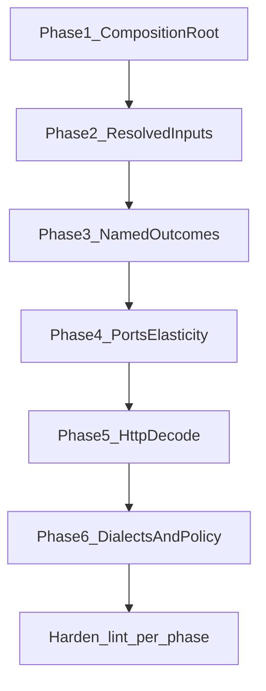

# Doctrine Reality Roadmap

## Framing

**Lint-green ≠ doctrine-true.** Compliance burns (`.catch(console.error)`, `parseBoundaryJson` wrappers, `AbortSignal.timeout`) are tripwires. This plan is the **architecture program**: composition roots, resolved inputs, named outcomes, real ports, one dialect per concept class — then encode each win in `lint:arch` so the next change cannot undo it.

```text
UI → client → API (owner)
              ↓
     composition root  ──resolves──► values the core needs
              ↓
          execution core          (never heard of the owner’s private IDs)
```

That diagram from [docs/doctrine.md](docs/doctrine.md) is the success criterion. Today half of it exists; half still reaches into ambient folklore.

---

## Full issue catalog (doctrine vs reality)

Grouped by doctrine lens. Severity = architecture leverage, not lint noise.

### A. Composition roots (shell owns wiring)

| ID | Issue | Where | Doctrine | Reality |
|----|--------|-------|----------|---------|
| A1 | **Run shell lives under `api/runs/`** | [packages/server/src/api/runs/orchestrator.ts](packages/server/src/api/runs/orchestrator.ts), `execution/**` | `api/` = thin HTTP; shell owns loop | `AgentOrchestrator` is queue + host + policy + workspace |
| A2 | **Boot depends on `api/` product folders** | [packages/server/src/boot/context.ts](packages/server/src/boot/context.ts), `sync-platform.ts` | Boot wires adapters; surfaces stay thin | Boot imports connectors/sync/proposer from `api/` |
| A3 | **Triple `configureAgent` + late-bound ports** | boot + orchestrator + `run-executor/host.ts` | Resolve once; cores get values | Boot host, throwaway tool-list host, per-run host |
| A4 | **UI widgets own run start** | [AgentChat.tsx](packages/ui/src/widgets/AgentChat.tsx), [TermChat.tsx](packages/ui/src/widgets/TermChat.tsx) | `state/` = composition root | Widgets call `api.startRun` directly (duplicated) |
| A5 | **Second UI exec root** | [env-sync/exec-store.ts](packages/ui/src/widgets/env-sync/exec-store.ts) | One client composition root | Module-level sync-exec store |

### B. Resolved inputs (cores never resolve folklore)

| ID | Issue | Where | Doctrine | Reality |
|----|--------|-------|----------|---------|
| B1 | **Planner assess reads ambient tenant** | [known-vocabulary.ts](packages/agent/src/domain/tenant/known-vocabulary.ts), [assess.ts](packages/agent/src/core/plan/decision/assess.ts) | Pass resolved vocabulary in | `getTenantConfig()` defaults inside core path |
| B2 | **Domain loads disk + mutable singletons** | [tenant-config.ts](packages/agent/src/domain/tenant/tenant-config.ts), published-sync vocab | Domain = shapes only; shell loads | `node:fs` + module `let` in domain |
| B3 | **Server prompting reads ambient tenant** | [api/runs/prompting/**](packages/server/src/api/runs/prompting/) | Snapshot from composition root | `getTenantConfig()` at prompt build |
| B4 | **Sync domain probes live MSSQL readiness** | [sync-env-eligibility.ts](packages/sync/src/domain/sync-env-eligibility.ts) | Domain gets `readyIds: string[]` | Calls `host.mssql.pools.list()` |
| B5 | **Bandit tuner designed, never wired** | orchestrator types + `runtime/delegate/learning.ts` | Wire or delete | Always `undefined` |

### C. Named outcomes (no silent fallthrough)

| ID | Issue | Where | Doctrine | Reality |
|----|--------|-------|----------|---------|
| C1 | **`attemptPlannerRouting` returns `{}`** | [choose-path/index.ts](packages/agent/src/core/choose-path/index.ts) | Named outcomes at decide boundary | Empty object; named outcomes only in runtime wrapper |
| C2 | **Planner-disabled is trace-silent** | same | Auditable assess vs economics | No trace when planner off / missing delegate |
| C3 | **Sync execute: throw vs return object** | [execute.ts](packages/sync/src/runtime/orchestrator/execute.ts) | One public outcome type | ~15 preflight `throw`s + inner `{ success, error? }` |
| C4 | **Catalog parse silent defaults** | [catalog-definition-parse.ts](packages/sync/src/domain/catalog-definition-parse.ts) | Named parse miss | Fall back to default definitions |
| C5 | **Tier-1 `shouldDelegate` naming lies** | [delegate-decision](packages/agent/src/core/delegate-decision/), setup-delegation | Vocabulary matches behavior | `false` still spawns serial/guided children |

### D. Elasticity (ports vs concrete stacks)

| ID | Issue | Where | Doctrine | Reality |
|----|--------|-------|----------|---------|
| D1 | **Core imports concrete MSSQL/catalog tools** | `core/doctrine/*`, `core/clarify/*` → `tools/database/mssql`, `tools/catalog` | Core pure; ports name I/O | Policy coupled to tool internals |
| D2 | **API → SQLite direct (70+ files)** | `api/**` → `infra/persistence/sqlite.js` | Persistence behind ports | No server persistence ports |
| D3 | **Connector adapters under `api/connectors/state/`** | movement-port, mssql-pool-provider | `adapters/` owns drivers | Product surface owns infra |
| D4 | **Sync runtime `getPool` + raw `fetch`** | execute.ts, [http-flow-step.ts](packages/sync/src/runtime/orchestrator/http-flow-step.ts) | I/O via ports | Driver + HTTP in orchestrator spine |
| D5 | **RunContext imports MSSQL tool helper** | [run-context.ts](packages/agent/src/runtime/host/run-context.ts) | Runtime uses ports/domain | Concrete `schema-verified` import |

### E. HTTP → domain boundary (real decode)

| ID | Issue | Where | Doctrine | Reality |
|----|--------|-------|----------|---------|
| E1 | **Routes trust TS body types + casts** | sync/runs/connectors routes | Decode `unknown` → validate → domain | `PreviewBody` etc. with no runtime decoder |
| E2 | **`parseBoundaryJson` + `as T` theater** | api after prior burn | Named decoder **then validate** | Still cast-as-trust |
| E3 | **Warehouse SQL in transport** | [warehouse/routes.ts](packages/server/src/api/warehouse/routes.ts) | Thin surface + service/port | Raw `SELECT` in route |

### F. One dialect / one home

| ID | Issue | Where | Doctrine | Reality |
|----|--------|-------|----------|---------|
| F1 | **UI presentation forks** | OperationLog, termchat/milestone, agentchat/toolFormat, RunStatus | One presentation SoT | Parallel label maps |
| F2 | **Wire projection in state + widgets** | store `formatLogEntry`, LiveLogs, tool-call-io | Projection in `lib/events` | Switches in state/widgets |
| F3 | **God `sync` HTTP surface** | [sync/routes.ts](packages/server/src/api/sync/routes.ts) (~861 lines) | One thin owner per capability | Preview/execute/publish/CRUD in one file |
| F4 | **Ghost delegate tool handling** | loop tool-execution, memory truncation | Erased dialect deleted | Branches on tools that are not registered |
| F5 | **Duplicate validation trees** | `core/delegation-validation` vs `runtime/delegate/validation/gates-*` | One home | Shadow files |
| F6 | **Dual chat widgets** | AgentChat + TermChat | Same class → same shape | Parallel orchestration |

### G. Policy & trust rails

| ID | Issue | Where | Doctrine | Reality |
|----|--------|-------|----------|---------|
| G1 | **HTTP policy only on sync preview/execute** | sync-http-policy vs publish/connectors/runs/platform | One governance rail for tools **and** HTTP | Admin ACL / no policy elsewhere |
| G2 | **Decision RNG/clock ambient in core** | retry, circuit-breaker | Injected at composition root | Defaults inside core call sites |

### H. Observability / cleanup (lower leverage, still real)

| ID | Issue | Notes |
|----|--------|-------|
| H1 | Duplicate Tier-0 assess traces | choose-path + setup |
| H2 | Unused `adhoc` spawn branch | erase or wire |
| H3 | `_default` tenant hardcoding | multi-tenant readiness |
| H4 | `http/build-app.ts` owns admin mutations | move to api surfaces |

---

## Sequencing principle

Order by **doctrine dependency**, not by how easy lint is:

1. **Shell must be the composition root** (A) — otherwise resolved inputs have nowhere honest to live  
2. **Push resolved values into cores** (B) — the §4 hard law  
3. **Name public outcomes** (C) — decide/execute APIs become readable and testable  
4. **Cut concrete stacks out of cores** (D) — elasticity  
5. **Real HTTP decode** (E) — trust at the door  
6. **Collapse dialects** (F) + **one policy rail** (G)  
7. **Encode each phase in lint** so peanuts cannot replace design again  



---

## Phase 1 — Composition root (make the shell real)

**Goal:** Process/run wiring no longer lives inside HTTP product folders.

**Moves:**
- Extract `AgentOrchestrator` + run executor + tool registry wiring from `api/runs/` → `packages/server/src/runtime/` (or `boot/runtime/`)
- Keep `api/runs/routes.ts` as thin HTTP → runtime commands
- Relocate connector MSSQL/movement adapters from `api/connectors/state/` → `adapters/connectors/`
- Boot imports `runtime/` + `adapters/`, not `api/*/service` for host construction
- UI: add `store.startRun(goal, threadId)` (and sync-exec actions); AgentChat/TermChat call store only

**Done when:** Changing transport (Fastify route shape) does not require editing orchestrator; widgets do not call `api.startRun`.

**Lint after:** forbid `api/**` importing run-executor/orchestrator internals; forbid widgets importing `client` for `startRun` (must go through `state/`).

---

## Phase 2 — Resolved inputs (doctrine §4 hard law)

**Goal:** Cores never call `getTenantConfig()` / live pool lists / published vocab loaders.

**Moves:**
- Load tenant + published sync vocabulary at boot; pass `TenantRoutingContext` / `KnownVocabulary` into:
  - `assessPlannerDecision`, clarify detectors, `createPlannerContext`
  - server prompt builder (no ambient reads)
- Sync: `readyMssqlConnectorIds(readyIds)` — shell resolves, domain receives data
- Move domain disk loaders to `runtime/host` or server boot; domain keeps frozen types only
- Wire or delete `delegationBanditTuner` (no half-dead paths)

**Done when:** grep shows zero `getTenantConfig` under `agent/src/core` and `sync/src/domain`; assess tests inject vocabulary explicitly.

**Lint after:** strengthen `resolved-inputs` — ban known folklore symbols (`getTenantConfig`, `getPublishedSyncEntityIds`, `pools.list`) under `core/` and `domain/` (except boot allowlist paths outside those layers).

---

## Phase 3 — Named outcomes at public decide/execute seams

**Goal:** Public APIs return discriminants; traces distinguish assess vs economics vs disabled.

**Moves:**
- Replace `attemptPlannerRouting(): { finalAnswer? }` with a named union (mirror `tryPlannerPath` outcomes at core)
- Emit assess-trace for planner-disabled / missing delegate
- Sync `executeSync`: single `SyncExecuteResult` discriminant (preflight refuse | skipped | success | failure) — no throw/return split for control flow
- Rename Tier-1 fields so vocabulary matches spawn behavior (`fanout` vs `executionMode`)
- Catalog parse: `{ ok, value } | { ok: false, reason }` instead of silent default

**Done when:** callers cannot ignore a refuse path; planner-off is visible in traces.

**Lint after:** tighten `named-outcome` beyond empty-catch — ban bare `return {}` / `return undefined` from exported `attempt*|execute*|assess*` in core/runtime public modules (registry-driven name list).

---

## Phase 4 — Ports & elasticity

**Goal:** Change MSSQL/catalog/HTTP without rewriting core policy.

**Moves:**
- Extract catalog/MSSQL **policy interfaces** used by `core/doctrine` and `core/clarify` into domain-facing pure modules or ports; tools implement
- Introduce server `ports/persistence` (or per-domain readers); migrate hot `api/**` off direct `sqlite.js` (start with runs + sync)
- Sync: `HttpPort` + `DbPoolPort`; orchestrator stops importing `getPool` / raw `fetch`
- Fix `run-context.ts` MSSQL helper dependency

**Done when:** `core/` has no imports under `tools/database/mssql` or `tools/catalog/graph` (only ports/domain).

**Lint after:** shrink allowed `core → tools` matrix (or denylist those subtrees); forbid `runtime/orchestrator` importing `adapters/mssql` directly.

---

## Phase 5 — HTTP → domain (real decode)

**Goal:** Trust boundary owns validation; routes stay thin.

**Moves:**
- Introduce real decoders (typed validators — project already avoids zod; use hand validators or add one schema lib as a **deliberate** dependency) for Preview/Execute/Run start/Connector bodies
- `parseBoundaryJson` only returns `unknown`; route must call `decodeX(unknown) → Result<Domain, DecodeError>`
- Split god sync routes by capability (preview/execute vs definitions vs publish) under clear owners
- Warehouse: move SQL to service behind connector port

**Done when:** invalid wire is rejected at the door with named decode errors; no `as EntityType` on request bodies.

**Lint after:** ban `as` on `parseBoundaryJson` results in `api/`; require `decode*` / `validate*` CallExpression in the same function (AST heuristic) or mark decoder modules as the only cast sites.

---

## Phase 6 — Dialects + one policy rail

**Goal:** One home per concept class; one governance path.

**Moves:**
- Collapse UI label maps into `@mia/shared-types` presentation; OperationLog uses catalog projection
- Move `formatLogEntry` projection from `state/store.ts` → `lib/events`
- Delete ghost `delegate`/`delegate_parallel` handling + duplicate validation gate files
- Extend HTTP policy helper beyond sync preview/execute to mutating surfaces that mirror tools (publish, connector write, run start where applicable)
- Inject `rng`/`clock` at composition root into retry/circuit-breaker

**Done when:** adding an event kind is catalog-only; HTTP mutations share the same policy evaluator family as tools.

**Lint after:** expand dialect registry (ban new `TOOL_*` / `formatEventLabel` switches in widgets); policy coverage checklist as catalog-like registry for mutating routes.

---

## What we will not do in this program

- Another mass `.catch(console.error)` / timeout / brand-cast sweep  
- Growing debt allowlists  
- Pattern decoration (Strategy/Saga folders) without fixing ownership and resolved inputs  

---

## First concrete delivery (start of Phase 1+2 spine)

Land **one vertical slice** that proves the diagram end-to-end:

1. Move run orchestration out of `api/runs/` into server `runtime/`  
2. Pass `KnownVocabulary` into `assessPlannerDecision` from that composition root (server run path)  
3. Named outcome type for `attemptPlannerRouting`  
4. Encode: folklore bans under `agent/core` + thin `api/runs/routes.ts` import rules  

That single slice makes doctrine **felt** in planner routing — the highest-signal path — before boiling the ocean on sync UI dialects.
