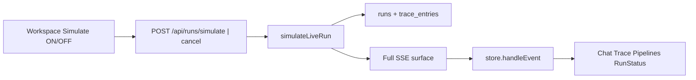

# Live run simulator (dev-only workspace switch)

## Goal
A **dev-only** control in the workspace: a simple **ON / OFF switch**.

- **ON** — start (or keep) whole-platform live simulation. Chat mode, chat widget, Trace, Pipelines, Run status, sync, ask_user, etc. all behave as if a real agent were running.
- **OFF** — cut off the simulation immediately (cancel active sim run), leave the product in a normal state (no leftover “fake live” status).

Fully **configurable**: which scenario to play, and pace — not a one-shot mystery button.

Scenarios: **Direct**, **Planner (sequential)**, **Planner (parallel)**.

## Dev-only gate
- UI switch renders only when `import.meta.env.DEV` (Vite) — never in production builds.
- Server rejects `POST /api/runs/simulate` unless `NODE_ENV !== "production"` (or explicit `MIA_ALLOW_RUN_SIMULATE=1` for local prod-like boots). No admin-only product chrome; this is a harness.

## UX (workspace)

Quiet control on the **workspace toolbar** (ops rail, next to Add / sheet knobs — not chat-home marketing chrome):

1. **Simulate** switch (OFF by default).
2. When OFF: product is normal; switch is the only harness affordance.
3. When turning **ON**:
   - Read current config (scenario + pace).
   - Call simulate API → focus `threadId` / `runId` so chat tile + Trace follow.
   - Playback streams until scenario ends **or** user flips OFF.
4. When turning **OFF** (or scenario ends):
   - Cancel active sim run via existing cancel path.
   - Clear any “simulating” local flag; do not force-navigate away from the finished thread (user can inspect) — run status is terminal, not live.
5. **Config** (compact, next to switch or a tiny disclosure):
   - Scenario: `direct` | `planner-seq` | `planner-parallel`
   - Pace: `fast` | `normal` | `slow` (maps to player delays)
   - Persist config in `localStorage` (or layout prefs) so it sticks across reloads; switch itself stays OFF after reload (safe default — never auto-start sim).

No Trace-only menu as the primary control. Trace may show a quiet “Simulating…” affordance while ON, but the switch lives in workspace chrome so it is always reachable.

Optional later: same switch mirrored in chat mode — **not required for v1**; workspace switch + active run focus is enough to watch chat mode if the user switches shell while a sim is live (SSE continues).

## Approach
Server player. Real `runs` row + persisted `trace_entries` + paced **full SSE fan-out**. No client-side fake `handleEvent`.

## Full SSE fidelity (required)

| Trace / phase | Also broadcast |
|---|---|
| Run start | `run.queued` (incl. `threadId`), `run.started` |
| Planner | `planner.started` + pipeline/step events as applicable |
| `tool-call` | `step.started` + `tool_call.executing` |
| `tool-result` / `tool-error` | `step.completed` / `step.failed` + `tool_call.completed` |
| `sync-progress` | matching `sync.agent.*` |
| `delegation-*` / parallel | `delegation.*` / `parallel-*` |
| `thinking` | `agent.thinking` |
| ask_user | `user_input.required` / `user_input.response` |
| `usage` | `usage.updated` |
| Final answer | `answer.chunk` then `run.completed` (or failed/cancelled) |

Cancel registry: AbortController per sim `runId`; `POST /api/runs/:id/cancel` aborts the loop (switch OFF uses this).

## Server

1. **Scenarios** — extract from [`seed-demo-trace-thread.ts`](packages/server/src/cli/seed-demo-trace-thread.ts) → [`demo-run-scenarios.ts`](packages/server/src/api/runs/service/demo-run-scenarios.ts) (`direct`, `planner-seq`, slim `planner-parallel`).
2. **Player** [`simulate-live-run.ts`](packages/server/src/api/runs/service/simulate-live-run.ts) — pace from request (`fast`/`normal`/`slow`); companion SSE mapper; cancel hook.
3. **Routes**
   - `POST /api/runs/simulate` `{ scenario, pace?, threadId? }` — dev-gated; returns `{ runId, threadId }`
   - Existing cancel endpoint stops the player
4. Seed CLI imports shared scenarios.

## UI

1. `api.simulateRun` / reuse `cancelRun`.
2. Workspace toolbar: **Simulate switch + scenario/pace config** (dev-only).
3. Shared `startSimulatedScenario` / `stopSimulation` helpers; track `simulatingRunId` in a tiny local/module state (or store slice) so OFF always cancels the right run.
4. Store: `run.queued` prefers `data.threadId`.

## Out of scope
- Shipping the switch in production builds
- Auto-start simulation on page load
- Client-only event injection
- Full kitchen-sink as a fourth scenario (static seed remains)

## Manual check
- DEV build: switch visible in workspace; prod build: absent
- ON + Direct → chat tile + Trace + Pipelines animate; shell-toggle to chat mode still shows the live run
- OFF mid-run → cancelled, no stuck pending/running
- Change scenario/pace, ON again → new sim with new config
- Reload with switch OFF → normal app, no auto-sim
