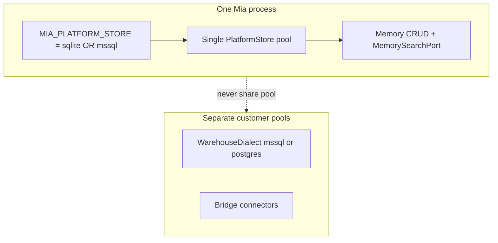
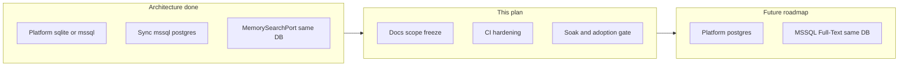

# RDBMS production sign-off and handoff

## Situation (locked)

Architecture for the **targeted** matrix is done. Remaining work is **scope formalization + operational hardening**, not new dialect discovery.

### One platform store — not two RDBMS for Mia’s life

**Wrong reading:** “App runs on MSSQL, plus a SQLite sidecar for memory search.”

**Correct model:** At any moment Mia’s platform durability sits on **exactly one** RDBMS chosen by `MIA_PLATFORM_STORE`:

- Local/dev → **sqlite** (one file; FTS5 lives in that same DB).
- Hosted → **mssql** (one Kysely/tedious pool; memory rows + keyword search live in that same DB).

You do **not** run sqlite and mssql together as the platform. Switching is config + boot, not a hybrid.

“Tier 1 / Tier 2” is **search quality on the chosen store**, not a second database:

| If platform is… | Memory keyword search is… | Same DB? |
|---|---|---|
| sqlite | FTS5 BM25 (`memory_entries_fts`) | Yes — sqlite only |
| mssql | Explicit degraded token/recency filter on `memory_entries` | Yes — mssql only |

No sqlite-for-search bolt-on when hosted. That would violate first principles: two durability homes, split truth, dual backup/migrate/tx stories, and silent quality cliffs.

**What *is* multi-RDBMS (and should stay that way):** separate concerns, never mixed pools —

- **Platform store** = Mia’s own life (users, runs, memory, policies…).
- **Warehouse Sync / Bridge** = customer From/To databases (mssql or postgres connectors). Those are not “the platform”; they are domain I/O.

**Is this the right first-principles path?** Yes for maintainability and scale of *concerns*:

- One platform dialect per deployment → one migration story, one backup, one tx boundary.
- Adapter/port for search → engines differ honestly (FTS5 vs degraded vs future Full-Text) without pretending parity.
- Warehouse stays pluggable independently of where Mia itself is hosted.

Acceptable product trade-off today: hosted mssql memory recall is **weaker than** local sqlite FTS until roadmap Track B (SQL Server Full-Text). That is named Tier-2 behavior, not “also keep sqlite around for search.”

### How much does degradation actually hurt? (honest)

Agent path is real: every run calls `retrieveContext` in [`run-executor/tools.ts`](packages/server/src/runtime/execution/run-executor/tools.ts) and injects working/episodic/semantic into the system prompt (plus episodic-shortcut / tool-section decisions). So keyword recall quality **does** affect agent behavior — not a side admin UI.

**What stays equal on mssql (not FTS-dependent):**
- Memory CRUD, tenancy (`upn`/`shared`), thread-scoped working window, ingest/prune/caches.
- Post-candidate scoring blend (recency, confidence, activation) once rows are fetched.
- Optional vector blend if embeddings exist (app-side cosine) — independent of FTS5.

**What gets worse on mssql Tier-2:**
- Candidate fetch: FTS5 `MATCH` + BM25 `rank` → `LIKE %token%` OR-any-token + hit-count/recency (see [`degraded-search.ts`](packages/server/src/infra/persistence/adapters/mssql/memory/degraded-search.ts)).
- No real relevance model; easy over-recall on common tokens, under-recall on phrasing/stemming.
- FTS also indexes `metadata`; degraded searches `content` only.
- Scale: leading-wildcard `LIKE` does not use a proper full-text index — fine for small/medium tenant memory, painful as `memory_entries` grows.

**Practical severity (not a lab score):**
- Short threads / mostly working-memory: **mild** — recency + thread filters still carry a lot.
- Cross-run episodic/semantic “remember that KPI / table / goal-class” recall: **material** — this is where BM25 mattered; Tier-2 is “good enough substring,” not “same agent memory.”
- MSSQL can store and filter the rows fine; it does **not** currently match sqlite FTS quality without Track B (Full-Text catalog) or accepting Tier-2 product limits.

| Matrix | Official targets | Explicitly out of this cut |
|---|---|---|
| Platform store | **Either** sqlite (local) **or** mssql (hosted) — never both at once | `MIA_PLATFORM_STORE=postgres` |
| Sync warehouse | Customer DB: mssql and/or postgres connectors (separate from platform) | — |
| Memory keyword search | Same platform DB: FTS5 if sqlite; degraded if mssql | SQL Server Full-Text catalog (future) |

**Already true in code (do not re-do):** [`assertPlatformStoreReady`](packages/server/src/infra/persistence/platform-store.ts) allows `sqlite|mssql` and only refuses postgres. Boot path is [`openConfiguredPlatformStore`](packages/server/src/infra/persistence/open-platform-store.ts).

---

## Phase 1 — Formalize the scope boundary

Stop leaving teams guessing whether postgres-platform or MSSQL FTS are “bugs.”

1. **Update the readiness plan footer** in [`.cursor/plans/sqlite_to_mssql_readiness_3d8e6870.plan.md`](.cursor/plans/sqlite_to_mssql_readiness_3d8e6870.plan.md):
   - Replace stale “Honest sizing / multi-quarter” framing with **delivered matrix + hardening backlog**.
   - State clearly: program success criteria for the targeted matrix are met; remaining items are sign-off / future tracks.

2. **Doctrine touch-up** in [`docs/doctrine.md`](docs/doctrine.md) §5c (platform / warehouse / connectors):
   - Platform selection: `sqlite|mssql` product; postgres platform = future adapter.
   - Sync warehouse: `mssql|postgres` peers; `mssql_procedure` capability-gated.
   - Memory: document Tier 1 / Tier 2 search as intentional product trade-off (never silent “same as FTS”).

3. **Operator-facing note** — short section in [`packages/server/src/infra/persistence/schema/README.md`](packages/server/src/infra/persistence/schema/README.md) (already the schema toolkit home):
   - Env: `MIA_PLATFORM_STORE`, mssql connection vars.
   - Memory search tiers + pointer to [`ports/memory-search.ts`](packages/server/src/ports/memory-search.ts) / mssql [`degraded-search.ts`](packages/server/src/infra/persistence/adapters/mssql/memory/degraded-search.ts).
   - Adoption gate: soak + green CI before defaulting hosted installs to mssql.

4. **Commit** after Phase 1 as docs-only milestone.

---

## Phase 2 — CI and reliability lock

Default approach: **always-on unit goldens for every PR**; **live MSSQL/PG service jobs path-filtered** (blocking when platform/sync/sql-kit paths change). Do not force SQL Server containers on unrelated UI PRs.

### 2a — Restructure [`.github/workflows/rdbms-matrix.yml`](.github/workflows/rdbms-matrix.yml)

- Keep `platform-sqlite` + `sync-unit` always required (current dialect/eligibility slice).
- Change `platform-mssql` and `sync-postgres-integration`:
  - Remove opt-in `vars.MIA_CI_MSSQL` / `vars.MIA_CI_PG` as the only gate.
  - Run on `pull_request` / `push` when paths match, e.g.:
    - `packages/server/src/infra/persistence/**`
    - `packages/server/src/ports/platform-store.ts`
    - `packages/server/src/ports/memory-search.ts`
    - `packages/sync/**`
    - `packages/sql-kit/**`
    - `.github/workflows/rdbms-matrix.yml`
  - Keep `workflow_dispatch` for manual full runs.
- Harden mssql service job: wait-for-ready + create DB (already sketched); fail loud if migrator/registry smoke fails.
- Align root script [`package.json`](package.json) `test:rdbms-matrix` with the always-on slice (document that service jobs are CI-only).

### 2b — Quarantine noisy Sync suite

- Do **not** make `npm test -w packages/sync` (full suite) the matrix gate — pre-existing orchestrator failures already exist outside dialect work.
- Add a tracked issue / note in the plan or `packages/sync/README` (or short `docs/` blurb if preferred): “full sync suite quarantine — matrix owns adapters/eligibility/warehouse-dialect only.”
- Optionally add `packages/sync` script `test:dialects` mirroring the matrix command so local = CI.

### 2c — Commit

CI workflow + script alignment as one milestone commit.

---

## Phase 3 — Hosted soak and adoption gate

No new dialect code. Prove mssql platform under real boot + traffic before recommending it as hosted default.

1. **Soak runbook** (short checklist in schema README or `docs/`):
   - Staging: `MIA_PLATFORM_STORE=mssql` + real connection env.
   - Boot: migrate registry v1–9, seeds, LLM override, memory prune path.
   - Exercise: login/session, run create/complete, memory ingest/retrieve, sync definition read, notification log insert (IDENTITY / `runInsertIdAsync`).
   - Watch: pool errors, hung txs, migration drift, degraded search quality notes.
   - Duration: multi-day staging soak (operator-owned; engineering provides the checklist).

2. **Adoption criteria** (all must hold):
   - Path-filtered CI green including live mssql job on a persistence PR.
   - Soak completed with no unresolved P0 store issues.
   - Memory Tier-2 documented for product/support.
   - Hosted deploy docs / env templates point at mssql (README or deploy notes — only where env is already documented).

3. **Do not** re-introduce an assert refuse for mssql. The gate is operational policy, not a code hard-stop.

---

## Verdict on “decouple search” (Meilisearch / Typesense / ES)

**For this repo: not the default next move. Valid later only if product proves dialect-native FTS is not enough.**

The Strategy-1 pitch is right about one thing: **LIKE ≠ FTS**, and pretending otherwise is Tier-2. It overreaches on the cure.

| Claim | Mia reality |
|---|---|
| “Any SQL FTS abstraction breaks down” | False if you keep `MemorySearchPort` and implement **dialect-native** FTS (FTS5 / CONTAINS / tsvector). What breaks is *one SQL dialect pretending to be all FTS engines*. |
| “Sidecar gives 100% parity” | True for *search UX*, at the cost of a second system: deploy, dual-write/outbox, lag, reindex, backup, local-dev burden. |
| Fits first principles / doctrine | Conflicts with **size** and **one durability home** for platform life. Local sqlite-as-one-file is a product feature; requiring Meilisearch for parity taxes every laptop and hosted install. |
| Agent memory vs product search | `retrieveContext` is prompt packing for the agent, not storefront search. Typo-tolerance and instant faceted UX are lower value than correct tenancy + recent working memory + good-enough episodic recall. |

**Preferred Track B (when product demands better than Tier-2):** MSSQL Full-Text catalog on the **same** platform DB behind existing `MemorySearchPort` — same shape as sqlite FTS5 adapter.

**Why not Track B right away (deliberate deferral, not fear of the work):**

1. **Wrong phase.** Sign-off is proving “platform mssql boots, pools, migrate, CRUD, CI, soak.” FTS is a *recall quality* upgrade on top of a store that is not yet operationally locked. Building FTS before soak risks optimizing the wrong pain.
2. **Ops surface, not a weekend SQL tweak.** SQL Server Full-Text needs the FTS feature/component, a catalog, index on `memory_entries`, population/change-tracking, language settings, and permissions. Many “SQL Server” targets (locked-down VMs, some managed SKUs) do not have FTS enabled — so you still need a **fallback** (today’s Tier-2) or a hard boot refuse. That is product/ops policy, not just code.
3. **No measured hosted bar yet.** We know Tier-2 is weaker in principle; we do not yet know from soak whether hosted agent pain is “wrong episodic recall” vs “pool/migrate/tx.” If soak shows working-memory-heavy use, Tier-2 may be acceptable for v1 hosted.
4. **Port is already the seam.** `MemorySearchPort` means Track B can land later without re-cutting persistence. Doing it now does not unlock mssql adoption; CI + soak does.
5. **Still not free after code.** Even a good `CONTAINS` adapter needs CI with FTS-enabled SQL Server image, catalog migrate idempotency, and docs for operators who must enable Full-Text.

**Escalate Track B into this program only if product already declares:** “Hosted mssql must not ship with Tier-2 recall.” Otherwise keep order: sign-off → measure → FTS.

**Deferred Track B′ (only if native FTS fails product bar):** external search adapter implementing `MemorySearchPort`, with outbox indexing from `memory_entries`. Do **not** dual-write from every ingest call without an outbox. Keep SQL as source of truth; search is a projection.

Do **not** adopt Strategy 1 as part of production sign-off. Sign-off stays: one platform store, Tier-2 named, harden CI/soak.

---

## Phase 4 — Future roadmap (park, don’t build now)

| Track | Goal | Rough size |
|---|---|---|
| A — Platform Postgres | Un-refuse `MIA_PLATFORM_STORE=postgres` | ~2–3 eng-weeks + soak |
| B — Dialect-native FTS (preferred) | MSSQL Full-Text / `CONTAINS` via `MemorySearchPort` | Product decision + catalog ops |
| B′ — External search (last resort) | Meilisearch/Typesense adapter + outbox | Larger ops tax; only if B fails bar |

Freeze rule: no Track A/B/B′ coding until Phase 2 CI is mandatory on relevant paths and Phase 3 soak criteria are written.

---

## Out of scope (this plan)

- New platform dialects, FTS catalog work, or search sidecars.
- Fixing the entire pre-existing `@mia/sync` orchestrator test suite (quarantine only).
- Bridge / `query_mssql` rewrites.
- Claiming “any RDBMS” — only the locked matrices above.

---

## Delivery commits (suggested)

1. Docs: scope freeze + Tier-2 search + doctrine/README.
2. CI: path-filtered live jobs + `test:dialects` / matrix alignment.
3. Soak runbook + adoption criteria (docs).
4. Roadmap stub for platform-postgres / MSSQL FTS (docs/plan only).
