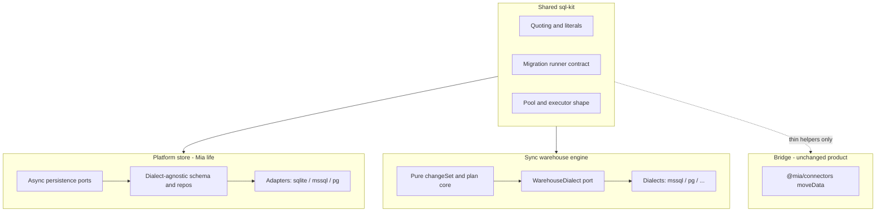
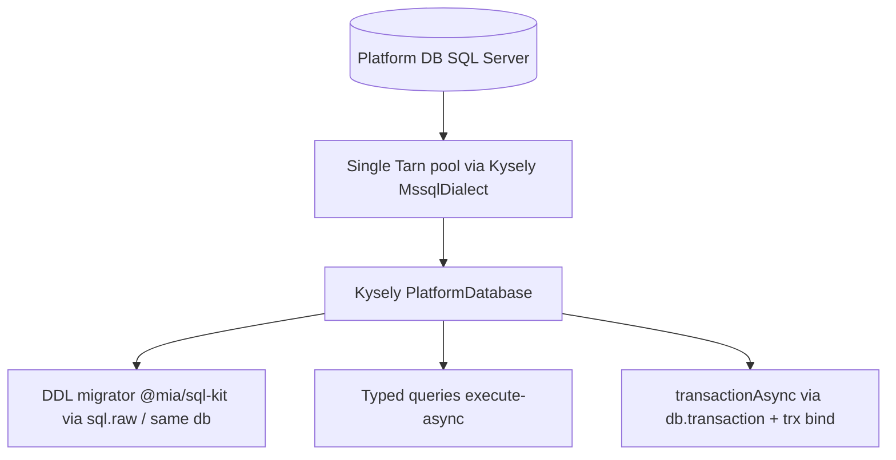

# RDBMS-agnostic platform + Sync (first principles)

## Ultimate goal (unchanged)

> Mia’s **own life** (platform durability) and Sync’s **warehouse reconcile engine** must not encode a single vendor’s SQL. Relational targets only: **SQLite | SQL Server | PostgreSQL**. Not MongoDB / document stores — different product class, out of scope.

**Success criteria (unchanged):**

- Swap `MIA_PLATFORM_STORE` between sqlite and one server RDBMS without rewriting API/services.
- Run Sync From/To against Postgres warehouse with same changeSet core as MSSQL (procs gated).
- Zero dialect SQL outside `adapters/**` (enforced by lint).
- Bridge and `query_mssql` still work; connectors not rewritten.
- Doctrine §5c: platform multi-dialect + warehouse Sync multi-dialect + **never mixed pools**.

Connectors used as **Bridge row-move** and agent **query_*** tools against customer DBs stay domain I/O. Shared **sql-kit**, not one mega-ORM over both worlds.

---

## Two concerns, one program

| Track | Owns | Agnostic of | Must NOT become |
|---|---|---|---|
| **B — Platform store** | users, sessions, runs, events, policies, entity registry meta, sync *definitions*/catalog, memory, approvals, … | Which RDBMS hosts Mia | Warehouse MERGE engine; Bridge |
| **A — Sync warehouse** | diff, fingerprint, apply/upsert/delete, SCD2 stamps, catalog drift, FK probes | Which RDBMS the *customer From/To* is | Platform `mia.db` schema |
| **C — Bridge connectors** | streaming read SQL → batch write | Already multi-dialect (mssql, pg, oracle, …) | Sync semantics |

**Connectors redo?** **No wholesale rewrite.** Optional thin share of quoting / identity helpers into sql-kit. Sync does **not** call `moveData` for apply.

---

## Progress (honest)

| Milestone | Status |
|---|---|
| 1 Doctrine + ports | **Done** |
| 2 sql-kit extract | **Done** |
| 3 Platform schema toolkit + SQLite Kysely cutover | **Done** — product repos on `run*Async` / portable upsert |
| 4 Platform second dialect (**hosted default: mssql**) | **Bootable** — single Kysely pool; registry v1–9; `openConfiguredPlatformStore` |
| 5–6 Sync WarehouseDialect + Postgres | **Done** — dialects + eligibility; procs capability-gated |
| 7 CI matrices | **Done** — always-on unit goldens; path-filtered live MSSQL/PG jobs |
| 8 Memory search / FTS port | **Done** — async CRUD; FTS5 sqlite / degraded mssql |

**Readiness:** Targeted matrix **delivered** — platform `sqlite|mssql` (one store per deploy); Sync warehouse `mssql|postgres`; memory Tier-1 FTS5 (sqlite) / Tier-2 degraded (mssql). Remaining work is **production sign-off** (docs, path-filtered CI, soak) — see `.cursor/plans/rdbms_production_signoff_0a436059.plan.md`. Not unfinished foundation.

---

## Milestone 4 — Platform MSSQL connection law (locked)

### Dependencies vs pools

- Declaring **`mssql` + `tedious` + `tarn`** in the same repo is **healthy**:
  - Platform store → Kysely `MssqlDialect` (**tedious + tarn**).
  - Warehouse Sync / Bridge → npm **`mssql`** (customer DBs; independent lifecycle).
- `mssql` is built on tedious; direct `tedious`/`tarn` deps for Kysely add no meaningful overhead.
- **Unhealthy:** two **active connection pools** to the **same platform database**.

### Dual-pool debt (interim — eliminate before boot)

Pilot scaffolding briefly opened:

1. `mssql.ConnectionPool` for migrator / `transactionAsync`
2. Kysely/tarn pool for typed queries

That is architectural debt. Statements on pool B do **not** run inside `BEGIN` on pool A (autocommit; no rollback protection). Also doubles sockets and complicates shutdown.

### Target platform MSSQL lifecycle (single handle)

**Laws:**

1. **`createMssqlPlatformKysely` is the sole platform MSSQL entry** — one Kysely instance (tedious + tarn).
2. **Migrator keeps `@mia/sql-kit` / multi-dialect registry** — only the executor changes to Kysely (`sql.raw(ddl).execute(db)`). Do **not** require Kysely’s built-in Migrator class.
3. **`transactionAsync` uses Kysely `db.transaction().execute`** — in-transaction work must use the transactional builder (`trx`), not a top-level ambient handle that escapes the tx. Rebind or pass `trx` explicitly.
4. **No `openMssqlPlatformPool` / platform `mssql.ConnectionPool`** — remove from platform lifecycle. Keep npm `mssql` for Sync/Bridge only.
5. **DDL scripts:** prefer `IF OBJECT_ID` batches **without `GO`**. If a hard batch break is needed, split into separate `execute` calls — do not introduce `GO` into the registry.
6. **Boot:** `assertPlatformStoreReady` allows `sqlite|mssql`; refuses postgres until that adapter lands. Open via `openConfiguredPlatformStore` (single Kysely handle).

### Cutover blueprint (platform store)

1. Retain `createMssqlPlatformKysely` as the single handle from `openMssqlPlatformStore`.
2. Wire migrator executor through Kysely.
3. Implement `transactionAsync` via Kysely; bind `trx` for ambient `getPlatformDb()` during the callback (or pass `trx` into work).
4. Delete platform `openMssqlPlatformPool`.

---

## Target architecture (full program)

### Platform store (Track B)

1. **Async persistence ports** — `PlatformStore.transactionAsync`; sync sqlite bridge during cutover only.
2. **Dialect-agnostic schema** — Kysely `PlatformDatabase` + multi-dialect DDL registry.
3. **Proper migrations** — versioned, idempotent; sqlite numbered runner today; mssql peer bodies in `migrations/registry.ts`.
4. **Adapters** — `adapters/{sqlite,mssql,postgres}`. Local default **sqlite**; **hosted default mssql**.
5. **Search/FTS** — `MemorySearchPort`: FTS5 on sqlite; degraded on mssql (Full-Text = future).
6. **Composition** — `MIA_PLATFORM_STORE` + connection env. Never warehouse connector pools for platform life.

**ORM choice:** Kysely under `server/infra/persistence` only. Raw dialect SQL outside adapters forbidden after cutover.

### Sync warehouse (Track A)

Unchanged goals: `WarehouseDialect`, extract T-SQL, add Postgres peer, capability-gate procs, eligibility `mssql|postgres`.

### Bridge / connectors (Track C — thin)

Leave Bridge multi-dialect move engine; thin sql-kit reuse only.

---

## What we refuse

- MongoDB / document DB as platform store.
- Routing platform durability through customer warehouse pools.
- Sync apply via Bridge `moveData`.
- Big-bang single PR rewriting platform + Sync + connectors.
- ORM everywhere including agent warehouse tools.
- Claiming FTS parity on mssql while keyword search remains Tier-2 degraded (name the gap; do not silent-fallback).

---

## Sequenced milestones (one program, not one PR)

1. **Doctrine + ports** — done.
2. **sql-kit extract** — done.
3. **Platform: schema toolkit + SQLite adapter** — done.
4. **Platform: second dialect (mssql hosted default)** — done:
   - **4a** Single Kysely/tedious platform pool — **done**
   - **4b** Multi-dialect registry v1–9 (incl. memory base) — **done**
   - **4c** Dialect-safe SQL + `run*Async` — **done**
   - **4d** Boot via `openConfiguredPlatformStore` — **done**
5. **Sync: extract MSSQL behind WarehouseDialect** — done.
6. **Sync: PostgreSQL dialect + eligibility + pool provider** — done.
7. **CI matrices** — `.github/workflows/rdbms-matrix.yml` + `npm run test:rdbms-matrix`.
8. **Memory search port** — done (FTS5 sqlite / degraded mssql).

---

## Delivered matrix + hardening backlog

| Concern | Delivered | Not this program |
|---|---|---|
| Platform store | **Either** sqlite (local) **or** mssql (hosted) — never both | `MIA_PLATFORM_STORE=postgres` |
| Sync warehouse | `WarehouseDialect` mssql + postgres; procs capability-gated | — |
| Memory keyword search | Same platform DB: FTS5 (sqlite) / degraded token-recency (mssql) | SQL Server Full-Text; external search sidecars |
| CI | Unit goldens always-on; live MSSQL/PG when persistence/sync/sql-kit paths change | — |

**Success criteria for the targeted matrix are met.** Storage choice for platform life is config + adapter (`sqlite|mssql`). Warehouse Sync is independently pluggable (`mssql|postgres`).

**Hardening (sign-off, not new dialects):** document Tier-2 search, mandatory path-filtered CI, hosted mssql soak before recommending hosted default.

**Future tracks (parked):** platform postgres adapter; MSSQL Full-Text via `MemorySearchPort` if product rejects Tier-2.
