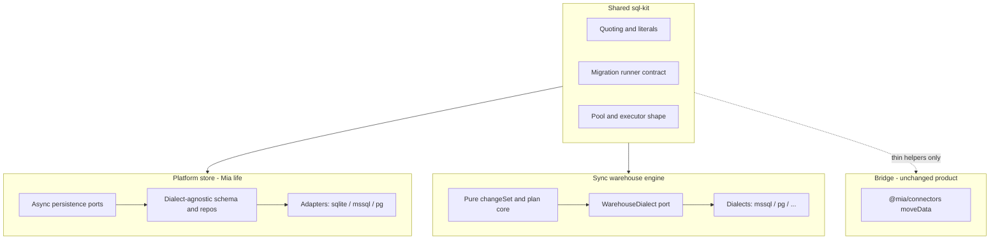

# RDBMS-agnostic platform + Sync (first principles)

## Reframe

It is **not** impossible. What failed the previous read is expecting a **drop-in swap** of today’s SQLite SQL strings for T-SQL. That path is a rewrite of bodies with no lasting power.

First principles demand a different product shape:

> Mia’s **own life** (platform durability) and Sync’s **warehouse reconcile engine** must not encode a single vendor’s SQL. Relational targets only: **SQLite | SQL Server | PostgreSQL**. Not MongoDB / document stores — different product class, out of scope.

Connectors used as **Bridge row-move** and agent **query_*** tools against customer DBs stay domain I/O. Sync’s MERGE / hash / catalog / apply stack is **not** “just connectors” — but this one program **does** make Sync dialect-agnostic in the same architecture investment as the platform store, with **shared sql-kit**, not one mega-ORM over both worlds.

---

## Two concerns, one program

| Track | Owns | Agnostic of | Must NOT become |
|---|---|---|---|
| **B — Platform store** | users, sessions, runs, events, policies, entity registry meta, sync *definitions*/catalog, memory, approvals, … | Which RDBMS hosts Mia | Warehouse MERGE engine; Bridge |
| **A — Sync warehouse** | diff, fingerprint, apply/upsert/delete, SCD2 stamps, catalog drift, FK probes | Which RDBMS the *customer From/To* is | Platform `mia.db` schema |
| **C — Bridge connectors** | streaming read SQL → batch write | Already multi-dialect (mssql, pg, oracle, …) | Sync semantics |

**One refactor feature** means: one architecture program, shared kit, doctrine update, dual CI — sequenced as extract-then-peer, not a single PR that rewrites everything.

**Connectors redo?** **No wholesale rewrite.** Optional: lift quoting / identity-insert / constraint-relax helpers into `sql-kit` so Sync and Bridge stop duplicating. Sync does **not** call `moveData` for apply.

---

## Why today feels “impossible”

| Layer | Today | First-principles target |
|---|---|---|
| Platform SQL | Raw SQLite in ~80 adapter files, sync `better-sqlite3` | Schema + repos via ORM/query layer; dialects as adapters; async ports |
| Platform migrations | Hand TS + PRAGMA | Proper migration tool (e.g. Drizzle Kit / Kysely + migrator / equivalent) generating or applying per dialect |
| Sync SQL | T-SQL MERGE, `#temp`, `sys.*`, HASHBYTES in runtime | `WarehouseDialect` plugins; core stays pure |
| Sync pools | `MssqlPoolProvider` only | Kind-aware pool providers (`mssql` \| `postgres`) |
| Abstraction | Folders + lint, not portable SQL | Ports that *forbid* dialect SQL outside adapters |
| Docs | “MSSQL only” sync; “one adapter” platform | Explicit multi-dialect laws in doctrine §5c |

Doctrine already separates platform store vs domain connectors ([docs/doctrine.md](docs/doctrine.md) §5c). Extend it: **platform RDBMS is pluggable**; **warehouse Sync is pluggable**; **neither shares the other’s connection**.

---

## Target architecture

### Platform store (Track B)

1. **Async persistence ports** — repository interfaces or stable async repo functions; `PlatformStore.transaction` becomes async.
2. **Dialect-agnostic schema** — one schema source of truth (ORM models or declarative schema) that compiles to sqlite / mssql / pg DDL.
3. **Proper migrations** — versioned, idempotent, multi-dialect; kill PRAGMA-only upgrade paths.
4. **Adapters** — `adapters/platform/{sqlite,mssql,pg}` implement the same ports. Default remain sqlite for local/dev; server RDBMS for hosted.
5. **Search/FTS** — abstract `MemorySearch` port: FTS5 behind sqlite adapter; SQL Server FTS or Postgres `tsvector` behind others (or external search later). Vectors stay portable (`BYTEA` / `VARBINARY` / blob).
6. **Composition** — `MIA_PLATFORM_STORE=sqlite|mssql|postgres` + connection config. Never use warehouse connector pools for platform life.

**ORM choice (committed default for this program):** prefer a **typed SQL / schema toolkit that owns migrations and multi-dialect** (Drizzle or Kysely-class — evaluate against ESM + lint:arch denylist; if Drizzle remains denylisted for agent cores, allow it **only** under `server/infra/persistence`). Raw string SQL in product repos is forbidden after cutover. Not Prisma-heavy ceremony unless evaluation says otherwise.

### Sync warehouse (Track A)

1. **Keep pure core** — changeSet classify/reconcile, plan assembly, entity registry *structure* stay dialect-free (already mostly so).
2. **`WarehouseDialect` port** — catalog (columns, PK, identity, FKs, triggers), `hashSelect`, `upsertBatch`, `deleteBatch`, session prefix, quote, constraint relax, identity handling.
3. **Extract current T-SQL** into `adapters/mssql/dialect/*` with zero behavior change (first milestone).
4. **Add `adapters/postgres/dialect/*`** + long-lived `PostgresPoolProvider` (mirror MSSQL provider pattern in server).
5. **SCD2** — policy stays; stamp presets become per-dialect expressions (`GETUTCDATE()` vs `NOW() AT TIME ZONE 'utc'`), not opaque vendor SQL baked as the only truth.
6. **Capabilities** — `mssql_procedure` / Mymi `usp*` / contract-deploy remain **MSSQL-only capabilities**; PG envs refuse those steps or use `custom_sql` / http. Do not pretend full proc parity in v1.
7. **Eligibility** — Sync From/To when connector kind ∈ `{mssql, postgres}` (enabled), not “MSSQL only.”

### Shared sql-kit

Minimal shared package or `packages/server` module (placement TBD with lint:arch):

- Identifier / literal quoting (seed already in [`packages/connectors/src/sql-idents.ts`](packages/connectors/src/sql-idents.ts))
- Executor error taxonomy (transient retry)
- Migration runner *contract* (platform uses it; sync does not migrate customer schemas)
- Pool provider interface shape (not one global pool)

Sync MERGE semantics and platform repos **do not** share one query builder — different workloads.

### Bridge / connectors (Track C — thin)

- Leave Bridge multi-dialect move engine as-is.
- Deduplicate quoting / identity / constraint helpers into sql-kit when Sync needs them.
- Agent `query_mssql` stays; `query_postgres` is a **separate** product add if needed — not required to finish Tracks A/B.

---

## What we refuse

- MongoDB / document DB as platform store (out of relational product class).
- Routing platform durability through customer warehouse pools.
- Implementing Sync apply by calling Bridge `moveData` (wrong semantics: bulk transfer ≠ entity reconcile).
- Big-bang single PR that rewrites platform + Sync + connectors together.
- “ORM everywhere including agent tools” — agent warehouse tools stay explicit SQL against customer dialects.

---

## Sequenced milestones (one program, not one PR)

1. **Doctrine + ports** — write the laws; add `WarehouseDialect` and async `PlatformStore` / persistence ports; update lint:arch.
2. **sql-kit extract** — quoting + pool shape; no behavior change.
3. **Platform: schema toolkit + async SQLite adapter** — behavior-preserving; tests still fast on sqlite.
4. **Platform: second dialect** (postgres *or* mssql — pick hosted default once; sqlite remains local).
5. **Sync: extract MSSQL behind WarehouseDialect** — goldens green.
6. **Sync: PostgreSQL dialect + eligibility + pool provider**.
7. **CI matrices** — platform (sqlite + hosted peer); sync (mssql + postgres integration).
8. **Memory search port** — last hard platform piece (FTS divergence).

Order 3–4 before or interleaved with 5–6 is fine; **do not** block Sync dialect extract on full platform ORM if ports are already sketched — but **shared doctrine and sql-kit land first**.

---

## Honest sizing

| Track | Signal |
|---|---|
| Platform agnostic (ORM + migrations + 2 dialects + FTS port) | Large — months; ~70 tables, async ripple, search redesign |
| Sync WarehouseDialect extract + Postgres peer | Large — ~2–4 eng-months for mssql+pg production sync |
| Connectors thin share | Small |
| Combined program | Multi-quarter architecture investment; still cheaper than two uncoordinated rewrites that invent quoting twice |

**Readiness today:** boundaries good; dialect portability poor. **After this program:** storage/RDBMS choice becomes config + adapter, which is the first-principles bar.

---

## Success criteria

- Swap `MIA_PLATFORM_STORE` between sqlite and one server RDBMS without rewriting API/services.
- Run Sync From/To against Postgres warehouse with same changeSet core as MSSQL (procs gated).
- Zero dialect SQL outside `adapters/**` (enforced by lint).
- Bridge and `query_mssql` still work; connectors not rewritten.
- Doctrine §5c updated: platform multi-dialect + warehouse Sync multi-dialect + still never mixed.
