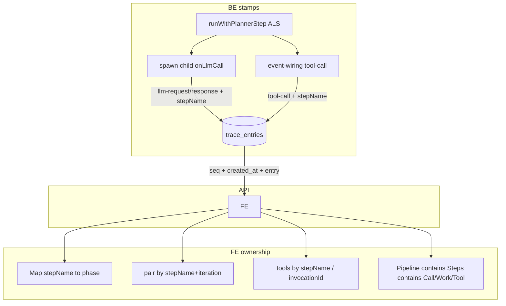

# Truthful Trace ownership

## Goal

Operators should read the Trace left tree as **what happened, under which loop scope, in what order**—same intimacy Chat already has for parallel tools. No invented parents under parallel fan-out; timing that does not pretend to be wall-clock when it is not.

## Chosen approach

**Full truth pack** (FE + minimal BE + timing meta). FE-only heuristics alone cannot make parallel child Calls truthful because `llm-request` has no `stepName` today.



## 1. BE — stamp step ownership on LLM rows

**Types** — [`packages/shared-types/src/index.ts`](packages/shared-types/src/index.ts):

- Add optional `stepName?: string` to `llm-request` and `llm-response` (same optional field as `tool-call`).
- Keep backward compatible (old traces omit it).

**Emit** — [`packages/agent/src/tools/delegate-spawn/spawn.ts`](packages/agent/src/tools/delegate-spawn/spawn.ts):

- When buffering child `onLlmCall`, set `stepName: trace.stepName` on both request and response events (already inside `runWithPlannerStep`).
- Parent direct-loop LLM in [`packages/server/src/runtime/execution/run-executor/agent.ts`](packages/server/src/runtime/execution/run-executor/agent.ts): leave `stepName` unset (direct route) — FE treats as spine-level Call.

**Optional hardening (same PR if cheap):** copy `stepName` onto `tool-result` / `tool-error` in event-wiring when the Step has `plannerStepName`. Not required if FE already pairs by `invocationId` to an existing tool-call row.

## 2. API — expose seq + created_at

Today REST strips meta:

```ts
// packages/server/src/api/runs/routes.ts
.map((entry) => parseBoundaryJson(entry.data))
```

Change `/api/runs/:id/trace` (and live SSE if needed) to return envelopes:

```ts
{ seq: number; createdAt: string; entry: TraceEntry }
```

- FE client normalizer accepts **both** bare `TraceEntry` (legacy) and envelope.
- Live path already has `seq` in SSE; add `createdAt` when broadcasting if available, else omit and fall back to order.

Wire through UI fetch in the runs/trace client path (find existing `getTrace` / atoms builder in [`packages/ui/src/lib/events/normalize.ts`](packages/ui/src/lib/events/normalize.ts)).

## 3. FE — rewrite ownership in `buildTraceDag`

Primary file: [`packages/ui/src/lib/events/build-trace-view.ts`](packages/ui/src/lib/events/build-trace-view.ts). Mirror the proven Chat pattern in [`packages/ui/src/lib/events/build-chat-parts.ts`](packages/ui/src/lib/events/build-chat-parts.ts).

**Replace** single `openPhase` / global `callByIteration` / bare `lastCallIndex` with:

| State | Role |
|---|---|
| `runningSteps: Map<string, TracePhaseNode>` | `planner-step-start` → phase; `planner-step-end` deletes |
| `openPipeline: TracePhaseNode \| null` | current pipeline attempt; steps nest under it when open |
| `stepCallKey → callIndex` | key = `${stepName ?? "_"}:${iteration}` |
| `stepLastCall: Map<string, number>` | last call under that step for Work attachment |
| `openWorkByStep` | Work buckets scoped per step |

**Pairing** — rewrite `pairLlmCalls`:

- Prefer match `(stepName ?? "", iteration)` when stamped.
- Fallback for old traces: FIFO within open step windows / outline-qualified keys (same as today’s outline nestKey `step:X/call:N`).

**Tool routing** (like Chat):

```ts
owner = entry.stepName ?? inferFromInvocationMap ?? serialOpenStep
ensureWork(owner, stepLastCall.get(owner))
```

`tool-result` / `tool-error`: attach via `invocationId` to the tool row already under the correct Work (no global lastCall).

**Spine prose shape** (truthful loop reading):

```
Context
Plan                    (milestone cluster)
Pipeline attempt N
  Subagent frontend     (step)
    Call 1
      Sent / Received   (proposed)
      Work              (executed tools — keep as readable bucket, not BE entity)
        Tool …
  Subagent api
Verify / Repair         (peers after pipeline closes)
```

- Nest **steps under open Pipeline** when `planner-pipeline-*` scope is open (today they are chronological peers — that misreads the loop).
- Plan / Verify / Repair stay milestone peers (they are not runtime containers for steps).
- Keep **Work** as the “executed after this call” prose bucket (clear vs Received proposals); ownership must be step+call scoped, not invented across agents.

**Timing** — [`enrichSpanTimings`](packages/ui/src/lib/events/build-trace-view.ts):

- Prefer `createdAt` deltas for `startOffsetMs` when envelopes exist.
- Prefer `planner-step-end.durationMs` for phase duration when present.
- When only LLM packing remains, keep numbers but treat waterfall as “LLM-active time” (no fake wall-clock story). UI copy/tooltip: short honest label if packing fallback is used.

**Simplify** `spineFromOutline` preference for body children once body is truthful — outline becomes reconciliation, not the only correct nest.

## 4. Left tree / inspector

[`packages/ui/src/widgets/trace/trace-tree-index.ts`](packages/ui/src/widgets/trace/trace-tree-index.ts) already walks `phase.children` — once DAG nests steps under pipeline and Calls under steps, the left tree reads as prose without a separate visual redesign.

Call titles: keep `Call N` **per step** (local index), not global iteration, so two subagents both at iteration 0 show as each step’s Call 1.

## 5. Tests (lock the contract)

| Test | Assert |
|---|---|
| Extend [`build-trace-dag.test.ts`](packages/ui/src/widgets/trace/build-trace-dag.test.ts) | **Interleaved parallel** two steps, both `iteration: 0`, tools with distinct `stepName` → each Call/Work/Tool under the correct Subagent |
| Same file | Steps nest under Pipeline when pipeline scope open |
| Pairing | Two `llm-request` with `stepName` A/B + iteration 0 pair to correct responses |
| Legacy | Entries without `stepName` still build serial trees (existing tests stay green) |
| Mirror Chat | Same fixture spirit as `build-chat-parts.test.ts` “nests parallel subagent tools by stepName” |
| Agent emit | spawn / planner test that child LLM traces include `stepName` |
| API | Trace route returns envelope; FE normalizer accepts both shapes |

## 6. Out of scope (intentionally)

- Redesigning outline card chrome / pin sticky.
- Inventing a BE “Work” entity (Work stays FE prose for executed tools).
- Changing chat parts (already correct); Trace catches up to that ownership model.

## Success criteria

1. Parallel subagents: zero cross-talk of tools or Calls between steps.
2. Tree reads top-down as loop prose: Plan → Pipeline → Subagent → Call → Work → Tool.
3. Timing is wall-clock when meta exists; never silently packs LLM durations as if they were wall time.
4. Old traces without stamps still render (serial-safe fallback).
