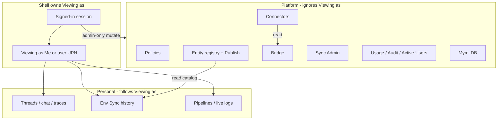
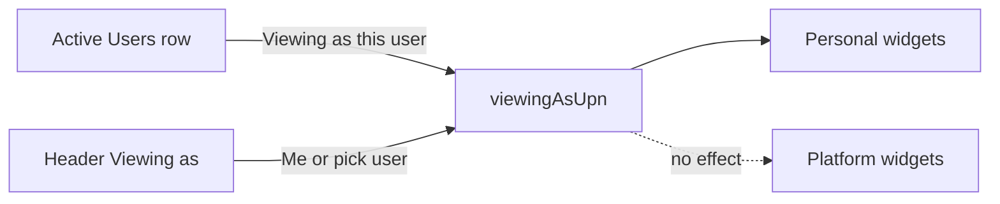

# Viewing as (unified Personal / Platform scoping)

## Vocabulary (one dialect — UI, code, docs)

Use **only** these terms. Do not invent synonyms in comments, names, or copy.

| Term | Meaning |
| --- | --- |
| **Viewing as** | Whose **Personal** data the app is showing. Always either **Me** or another user’s display name. |
| **Me** | Viewing as the signed-in session (`session.upn`). Default for everyone. |
| **Personal** | Someone’s work product (chats, runs, Env Sync history, pipelines, …). Follows Viewing as. |
| **Platform** | Shared truth for the whole deploy (policies, registry, connectors, Sync Admin, Usage, …). Ignores Viewing as. All admins see the same data. |
| **Admin / operator** | Who may *open* a surface (role). Orthogonal to Viewing as. |

**Code names (match the words):**

- `viewingAsUpn: string | null` — `null` means Me
- `resolveViewingAs(session, header)`
- Header: `X-Viewing-As: <upn>` (omit when Me)
- UI label: `Viewing as: Me` / `Viewing as: {displayName}`

**Do not use in this feature:** workspace subject, subject, inspect/inspecting, fleet, impersonation, context switcher, View workspace, setSubject, target context.

**Read-only rule (plain):** When Viewing as someone else, Personal writes are declined (no send chat, no Env Sync execute as them). Platform actions still run as the real signed-in admin and stamp that admin’s UPN.

---

## Verdict on the notes

**Direction: yes.** One app, admin picks Viewing as Me or another user; Personal widgets show that user’s data; Platform stays shared.

**Mechanism in the notes: no.** Do not pass `userId` into every widget. Do not load the other user’s dashboard layout. Layout stays the admin’s (`dashboard:${session.upn}`); only Personal data changes.

**Already true:**

- Multi-admin already shares most Platform data (policies, entity registry, connectors, Sync Admin queues).
- Thread/run lists already stick to session UPN (admins do not see each other’s chats in the main list).
- One widget catalog; operators are limited by `VISITOR_WIDGETS`.
- **Sync is two surfaces:** Env Sync (Personal) vs Sync Admin / registry / Publish (Platform).

**Incoherent today:**

- Personal APIs disagree: threads = own UPN; pipelines = all users when admin; Env Sync history = all users when admin.
- No single owner for Viewing as — each route invents its own `isAdmin` bypass.
- Active Users digs into one user’s runs inside the tile instead of using Viewing as + normal widgets.



---

## Role vs Viewing as (two axes)

| Axis | Question | Values |
| --- | --- | --- |
| **Role** | Who may open this surface? | admin vs operator |
| **Viewing as** | Whose Personal data fills Personal widgets? | Me vs another user |

### Platform control-plane = admin only

Keep and tighten (already mostly true):

- Catalog: operators only add `VISITOR_WIDGETS`.
- SessionMenu Administration: Connectors, Bridge, Usage, Policies, Audit.
- Admin-only widgets: `entity-registry`, `sync-admin`, `bridge`, `active-users`, …

Close gaps: mobile Policies `isAdmin` gate; Platform list APIs that any session can still read must match the admin gate.

**Mymi DB:** Platform for Viewing as (does not change when Viewing as someone else). Operators may still open it (read-only warehouse next to Env Sync). Not an admin-only control-plane modal.

### What the admin sees when Viewing as another user

**Their own admin workspace — not that user’s widget set or layout.**

| Unchanged (admin’s) | Changes to that user’s Personal data |
| --- | --- |
| Dashboard layout | Threads, chat, runs, traces |
| Full admin catalog / tiles on the canvas | Pipelines, live logs |
| Platform widgets and SessionMenu modals | Env Sync history (read-only) |

Viewing as answers “whose Personal data,” not “which buttons am I allowed.” Platform tiles keep working. Personal tiles refill with that user’s data; Personal writes disabled.

---

## Surface inventory

Test: **shared truth for the deploy, or someone’s work product?**

### Personal — follows Viewing as

| Surface | What it is | When Viewing as someone else |
| --- | --- | --- |
| Threads / Term Chat | Their conversations | Read-only |
| Agent runs / run-status / traces / debug | Their agent work | Read-only |
| Pipelines (`operation-log`) | Their correlated runs/events | Only that user’s pipelines |
| Live logs | Their event tail | Only that user’s events (fix today’s unscoped leak) |
| **Env Sync** | Their preview / execute / history | History read-only; no execute as them |
| Dashboard layout | Admin’s canvas | Unchanged |

### Platform — ignores Viewing as

| Surface | What it is | When Viewing as someone else |
| --- | --- | --- |
| Policies | One rule table for everyone | Same data; still editable by admin |
| Entity registry + Publish + freeze + env CRUD | One catalog / published contract | Same data |
| Connectors | Shared connection config | Same data |
| **Bridge** | Admin move tool over connectors | Still the admin’s tool; runs as signed-in admin |
| **Sync Admin** | Shared queues (proposals, approvals, all actors’ sync runs overview) | Same data — this is where “all admins see all sync ops” lives |
| Usage / Audit | All-users browsers | Same data; optional filter *inside* the modal is fine |
| **Active Users** | All-users list (see below) | Still shows everyone |
| Mymi DB | Shared warehouse browser | Same data |

### Sync split (same vocabulary)

```text
Env Sync     = Personal  → follows Viewing as
Sync Admin   = Platform  → ignores Viewing as (all admins, all actors)
Registry     = Platform  → ignores Viewing as
```

### Bridge vs Connectors

| | Connectors | Bridge |
| --- | --- | --- |
| Nature | Saved config | One-shot admin tool |
| Class | Platform | Platform |
| Viewing as | No effect | No effect (always acts as signed-in admin) |

### Attribution vs ownership

- **Ownership (Personal):** row belongs to a UPN; lists must match Viewing as.
- **Attribution (Platform):** `updated_by` / `actor` records who touched shared data; does not split the table per admin.

---

## Active Users — plain language

**What it is today:** An admin widget that lists users on the platform — who is online, rough usage stats, which runs are in flight, grant/revoke admin, and a per-user run history that opens inside the widget.

**What stays:** The all-users list, online/presence, in-flight runs, stats, grant/revoke admin. That is Platform: every admin sees the same list, and Viewing as does not filter it.

**What changes:**

1. Each user row gets a **Viewing as** action — same words and same meaning as the header control. Choosing it makes the app Viewing as that user (Personal widgets show their chats, runs, Env Sync history, pipelines). Choosing **Me** in the header (or an equivalent Back to Me) returns to the admin’s own Personal data.

2. Do **not** grow the embedded run history / run modal into another chat or trace product. If the admin needs that user’s threads or traces, they use Viewing as and the normal widgets. A short list of recent run ids/status in Active Users is fine; a second TermChat is not.

3. Active Users is **one** place to pick a user (rich list). The header is always available too: **Viewing as: Me | …** even when Active Users is not on the dashboard. Same state, same meaning — not two features.

4. One piece of app state owns this (`viewingAsUpn`). Header and Active Users both call the same functions. Widgets do not each store “which user.”

5. **Obvious when not Me:** header label reads **Viewing as: {displayName}** (never still says Me), plus a quiet shell accent. Optional quiet mark on that user’s row in Active Users. No loud marketing banner. Back to Me removes the accent and restores the admin’s Personal data.



---

## Server

Owned helper next to existing access code:

```ts
type ViewingAs = { viewingAsUpn: string; isMe: boolean }
function resolveViewingAs(session, header): ViewingAs
```

- Client sends `X-Viewing-As: <upn>` only when not Me.
- Server: admin only; target user must exist; otherwise named decline.
- Personal lists/gets/SSE: filter to `viewingAsUpn`.
- Personal writes: only when `isMe`.
- Platform routes: ignore the header.

| Surface | Today | After |
| --- | --- | --- |
| Threads / runs lists | session UPN | Viewing as UPN |
| Thread/run by id | admin bypass | owner === Viewing as UPN |
| `GET /api/runs?threadId=` | inconsistent | same helper |
| Pipelines | admin sees all | Viewing as UPN only |
| Env Sync history | admin sees all | Viewing as UPN only |
| Sync Admin / registry / … | shared | unchanged; ignore header |
| SSE / live events | uneven | owner === Viewing as UPN |

---

## UI

1. App owns `viewingAsUpn` ([App.tsx](packages/ui/src/app/App.tsx) / `app/viewing-as.ts`). Persist in `sessionStorage` keyed by real `me.upn`.
2. Client attaches `X-Viewing-As` when not Me. Widgets get no `userId` prop.
3. Header control in Toolbar, chat header, mobile header: **Viewing as: Me | {name}**.
4. Quiet accent when not Me (must know) — not a loud banner.
5. On change: reset Personal client state and reconnect SSE; leave Platform widgets alone.
6. Disable Personal send/execute in the UI when not Me; server enforces too.

---

## Out of scope

- Acting as the other user for writes (real impersonation).
- Loading another user’s dashboard layout.
- Multi-tenant beyond `_default`.
- Timeframe in the header.

---

## Implementation order

1. Server `resolveViewingAs` + Personal access helper; remove admin “see all” on Personal APIs; Platform untouched; Personal writes fail when not Me.
2. UI `viewingAsUpn` + header + client header + accent + reset on change.
3. Active Users: **Viewing as** row action wired to the same state; keep all-users list; do not expand in-widget chat/trace.
4. Doctrine note with this vocabulary only; smoke: two admins share Platform; under Me they do not see each other’s Personal data; Viewing as shows that user’s Personal data read-only; back to Me clears it.
