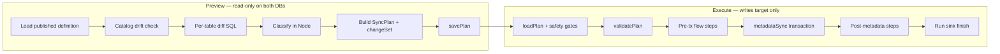

# Sync preview & execute

How `@mia/sync` builds a **SyncPlan**, where it lives, what SQL runs at each stage, and how execute turns that plan into writes on the target.

**Companion docs:** [SYNC-MECHANICS.md](./SYNC-MECHANICS.md) (hash diff model), [SYNC-MODEL.md](./SYNC-MODEL.md) (terminology).

**Scope:** MSSQL today. This document names what is engine-specific vs what could be ported.

---

## 1. End-to-end flow

```
UI / agent tool                Server route                 @mia/sync
─────────────────────────────────────────────────────────────────────────
POST /api/sync/preview    →    previewSync()           →    diff + plan build
GET  /api/sync/plan/:id   →    loadPlan()
POST /api/sync/execute/:id →   executeSync()           →    gates + metadata tx + post steps
GET  /api/sync/history    →    sync_runs (SQLite)      ←    run sink on preview/execute
```



**Key idea:** Preview classifies rows and persists a **SyncPlan** whose per-table **`changeSet`** lists every PK to insert, update, or delete. Execute applies **only those PKs** — no re-diff, no scope-wide reads.

---

## 2. Who calls what

| Entry | Code | Package export |
|-------|------|----------------|
| HTTP preview | `packages/server/src/api/sync/routes.ts` | `previewSync` |
| HTTP execute | same | `executeSync` |
| Agent tool | `packages/sync/src/application/shell/tools.ts` | `createSyncPreviewTool` / execute tool |
| Plan load | routes + execute | `loadPlan` / `savePlan` |

The **orchestrator** lives under `packages/sync/src/application/shell/orchestrator/`:

| Module | Role |
|--------|------|
| `preview.ts` | `previewSync` — builds plan |
| `execute.ts` | `executeSync` — gates + dispatches flow |
| `metadata-sync.ts` | In-tx MERGE/DELETE + FK toggles |
| `metadata-scope.ts` | `constraintRelaxationTables` vs `dataMovementTables` |
| `plan-table.ts` | `validatePlan`, changeSet row helpers |
| `apply.ts` | changeSet-driven MERGE / DELETE SQL |
| `post-metadata-pipeline.ts` | Steps after metadata (ETL, sync date, …) |
| `plan-store.ts` | Plan persistence API |

The **diff engine** lives under `packages/sync/src/domain/diff-engine/` — pure comparison logic + SQL for reads.

**SQL is never hand-written by operators.** It is composed at runtime by TypeScript (`sql-helpers.ts`, `columns.ts`, `apply.ts`, `catalog-drift.ts`, …) and sent through the `mssql` driver via `getPool(host, connectionName)`.

---

## 3. Preview — step by step

`previewSync(input)` in `preview.ts`.

**Unified diff model (all entity types):** The comparison algorithm is identical for contract, dataset, rule, etc. Published definitions only change which tables, scope predicates, and post-metadata steps run. For *which rows*, *why PK discovery*, and *how in-memory classification relates to SQL*, see [SYNC-MECHANICS.md §2–8](./SYNC-MECHANICS.md).

### 3.1 Inputs

| Field | Meaning |
|-------|---------|
| `entityType` | Published definition id (`contract`, `dataset`, …) |
| `entityId` | Instance id (e.g. `contractId = 2545`) |
| `source` / `target` | Named environment keys (`dev`, `uat`, …) |
| `enabledOptionalTables` | FK-closure tables user opted into |
| `userUpn` | Governance / audit attribution |

### 3.2 Definition compile (no SQL yet)

1. `getPublishedSyncDefinition(host, projectRoot, entityType)` — reads `sync-definitions/published/definitions.bundle.json`.
2. `selectDefinitionTables(definition, enabledOptionalTables)` — filters optional tables.
3. `instantiatePredicate(template, entityId)` — replaces `{id}` / `{ids}` in scope templates.

Example predicate evolution:

```
Template:  contractId = {id}
Instantiated: contractId = 2545
```

4. If the root table has a self-join, `expandTreeIds` runs a **read** on source to expand `{ids}` for hierarchical entities.

### 3.3 Preflight SQL (both connections)

| Step | Generator | SQL shape |
|-------|-----------|-----------|
| Catalog drift | `detectCatalogDrift` | `SELECT … FROM INFORMATION_SCHEMA.COLUMNS WHERE TABLE_SCHEMA IN (…)` on source **and** target |
| PK discovery | `fetchPkColumns` | `SELECT c.name FROM sys.indexes … WHERE is_primary_key = 1` on **source** — **required before hash diff**; supplies join key + `changeSet` PK columns |
| Display name | `fetchEntityDisplayName` | Definition-specific `SELECT` on source |
| FK integrity (contract) | `probeTargetFkIntegrityWarnings` | `SELECT` / `COUNT` orphan probes on **target** |

Catalog drift compares table/column presence and types for recipe tables only. Incompatible catalog → warnings on plan; execute hard-refuses.

### 3.4 Per-table diff (parallel, bounded concurrency)

For each active table, `diffTable()` in `diff-engine/index.ts` runs the same phases below. Logs emit `SyncPreviewTableStart` / `SyncPreviewTableDone` around this block.

**Phase A — PK columns (batch, once per preview)**

Already completed in §3.3 via `fetchPkColumns` for all active tables. Per-table `diffTable` receives `pkColumns` from that map.

**Phase B — hash input columns (source, once per table)**

Telemetry label: `fetchTableColumns(schema.table)`.

```sql
SELECT c.name, c.is_computed, c.is_identity, LOWER(ty.name) AS systemType
FROM sys.columns c
JOIN sys.objects o ON …
WHERE o.name = 'Contract' AND OBJECT_SCHEMA_NAME(c.object_id) = 'core'
```

Builds `hashColumns` — all non-computed, non-meta, non-identity columns. PK columns were discovered in Phase A and are used in the SELECT list but not in the hash expression.

**Phase C — fingerprint scoped rows (source + target, parallel)**

Telemetry label: `fetchPkHash(schema.table)` — **appears twice per table** (source pool and target pool; same label).

```sql
SET LANGUAGE us_english;
SET DATEFORMAT ymd;
…
SELECT [contractId],
       HASHBYTES('SHA2_256', ISNULL(CONCAT_WS('|',
         CONVERT(NVARCHAR(33), [col1], 126),
         CAST([col2] AS NVARCHAR(MAX)),
         …
       ), '')) AS rowHash
FROM [core].[Contract]
WHERE contractId = 2545
```

- Each row in the result set is one **scoped** row: PK value(s) + content fingerprint.
- Generated by `fetchPkHash` + `hashExpr` in `columns.ts` / `sql-helpers.ts`.
- Session prefix `DETERMINISTIC_SESSION_PREFIX` pins culture-invariant `CONVERT` styles.
- **No NOLOCK** on hash reads (dirty reads would flap classification between previews).
- **No join** between source and target at this stage — two independent queries.

**Phase D — classify in Node (no SQL)**

Implementation: `diff-engine/index.ts` — two `Map<pkString, PkHashRow>` plus two loops.

This is the **logical full outer join on primary key**, done **in memory in Node**, not a SQL `OUTER JOIN` and not a cross-database query:

1. Walk every PK in the **source** map → insert / unchanged / update vs target map.
2. Walk every PK in the **target** map → delete if missing from source map.

| Source map | Target map | `rowHash` | Bucket |
|------------|------------|-----------|--------|
| has PK | missing | — | insert |
| has PK | has PK | equal | unchanged |
| has PK | has PK | different | update |
| missing | has PK | — | delete |

Then `buildChangeSet(inserts, updates, deletes)` copies PK + `pkValues` into `plan.tables[].changeSet`.

**Phase E — scope conflict probe (target, if inserts exist)**

Telemetry label: `detectScopeMisattribution(table)`.

For single-column PK + `scopeColumn`, checks whether “insert” PKs already exist on target under a **different parent** (outside the scoped diff’s view):

```sql
SELECT [activityId], [pipelineId]
FROM [core].[PipelineActivity]
WHERE [activityId] IN (…)
```

Misattributed rows move from `insert` → `conflicts` and **block execute**.

**Phase F — changeSet (persisted execute instructions)**

After classification, the full PK lists are copied into the plan:

```typescript
changeSet: {
  insert: [{ pk: "99", values: { pipelineId: 99, contractId: 2545 } }],
  update: [],
  delete: []
}
```

Built by `buildChangeSet()` in `domain/diff-engine/change-set.ts`. This is the **single source of truth** for execute — see §4.2.

**Phase G — sample rows (UI only; execute ignores)**

Telemetry labels: `fetchSamples`, `fetchUpdateSamples.src`, `fetchUpdateSamples.tgt`.

```sql
SELECT * FROM [core].[ContractColumn] WHERE [contractColumnId] IN (1, 2, 3)
```

Up to 50 rows per bucket; update samples fetch **both** source and target for side-by-side diff.

### 3.5 Plan assembly

`preview.ts` aggregates `tableResults` into a `SyncPlan` object (see §4), adds:

- `totals`, `dependencyGraph`, `warnings`, `decisionLog`
- `executionContract` — frozen copy of definition metadata + flow steps
- `governanceDecision`, `preflight`, `entityPolicies`

Then `savePlan(host, plan)` (§5).

Events emitted throughout: `sync.preview.started`, `sync.preview.table.done`, `sync.preview.completed`, plus `sync.preview.sql` / `sync.execute.sql` for every query (label + duration + row count).

---

## 4. The SyncPlan object

Defined in `plan-store.ts`. JSON-serializable. **Immutable contract** for execute.

### 4.1 Top-level fields

| Field | Purpose |
|-------|---------|
| `planId` | UUID — primary key everywhere |
| `entity` | `{ type, id, displayName }` |
| `source` / `target` | Environment names |
| `tables[]` | Per-table diff result + frozen `scopePredicate` |
| `totals` | Aggregated movement + stats + conflicts — derived from tables at preview, validated at execute |
| `executionContract` | Definition id, table list, `executionOrder`, `reverseOrder`, flow `steps` |
| `preflight` | Catalog drift snapshot |
| `warnings` | Plan-level issues (governance, FK probes, failed diffs) |
| `decisionLog` | Explainability records for UI/history |
| `createdAtMs` | TTL math |

### 4.2 Per-table entry (`SyncPlanTable`)

| Field | Purpose |
|-------|---------|
| `table` | `schema.table` |
| `scopePredicate` | Frozen SQL fragment from preview (audit / reference) |
| `stats` | `unchanged`, `lowConfidence` — preview-only; not in `changeSet` |
| `changeSet` | Insert / update / delete PK lists — **execute authority**; movement counts = array lengths |
| `samples` | Up to 50 rows per bucket — **UI only**; execute ignores |
| `conflicts` | Scope misattribution details; `conflicts.length` blocks execute |

#### changeSet (execute authority)

```typescript
interface SyncPlanChangeSet {
  insert: SyncPlanChangeRow[]   // PK on source, absent on target
  update: SyncPlanChangeRow[]   // PK on both, hash differs
  delete: SyncPlanChangeRow[]    // PK on target, absent in source scope
}

interface SyncPlanChangeRow {
  pk: string                      // composite key string (diff-engine format)
  values: Record<string, unknown> // PK column values for targeted SQL
}
```

**Contract:** Execute applies **exactly** the rows in `changeSet`. It does not re-run the hash diff and does not `SELECT * WHERE scopePredicate` for upserts or deletes.

| Concern | Driven by |
|---------|-----------|
| Which rows to MERGE | `changeSet.insert` + `changeSet.update` |
| Which rows to DELETE | `changeSet.delete` |
| Which tables get MERGE | `dataMovementTables(plan)` — tables with non-empty changeSet insert/update |
| Which tables get FK NOCHECK | `constraintRelaxationTables(plan)` — ancestors through deepest changeSet op |

These last two scopes are **independent** — never conflate FK relaxation with data movement. Ancestors with zero changeSet ops are not re-MERGED.

Plans without `changeSet` cannot be executed — re-preview.

**Important:** Row I/O at execute is **O(changes)** via `changeSet` PK lists. `savePlan` and `executeSync` call `validatePlan` (changeSet required; `totals` must match `computePlanTotals`).

### 4.3 Execution contract

Snapshotted at preview time so a later definition publish cannot change what execute runs:

```json
{
  "definitionId": "contract",
  "metadata": {
    "executionOrder": ["core.Contract", "core.ContractColumn", "…"],
    "reverseOrder": ["…", "core.Contract"],
    "tables": [{ "name": "core.Contract", "scopeColumn": "contractId", "predicate": "contractId = {id}" }]
  },
  "flow": {
    "steps": [
      { "kind": "auditCheck", … },
      { "kind": "targetLock", … },
      { "kind": "metadataSync", … },
      { "kind": "datasetDeploy", … },
      { "kind": "syncDate", … }
    ]
  }
}
```

---

## 5. Where the plan is stored

Three layers (lookup order in `loadPlan`):

| Layer | Location | TTL | Written by |
|-------|----------|-----|------------|
| Memory | `host.sync.plans.memCache` | Process lifetime | `savePlan` |
| Disk JSON | `{diskRoot}/{planId}.json` | 24h | `savePlan` |
| SQLite | `sync_runs.plan_json` via run sink | No TTL | `savePlan` → server sink |

Server configures disk root at boot (`MIA_DATA_DIR/sync-plans/`, default `~/.mia/sync-plans/`). Execute refuses plans older than **1 hour** (`planTooOldToExecute`).

History UI reads `sync_runs` (paginated), not `event_log`.

---

## 6. Execute — step by step

`executeSync(planId, { host, confirm: true, userUpn })` in `execute.ts`.

### 6.1 Pre-flight gates (before any write)

| Gate | Code | Behavior |
|------|------|----------|
| Plan exists + age | `loadPlan`, `planTooOldToExecute` | 404 / error if >1h |
| Environment roles | `getEnvironment` | Source cannot be target-only |
| PROD lock | env check | Unless `SYNC_ALLOW_PROD=1` |
| Allowlist | target env | User UPN must be listed |
| Catalog drift | `detectCatalogDrift` | **Hard refuse** if incompatible |
| Scope conflicts | plan `tables[].conflicts` | **Hard refuse** if any |
| Plan validation | `validatePlan` | **Hard refuse** if changeSet missing or `totals` ≠ derived from changeSets |

### 6.2 Flow dispatch

`executionContract.flow.steps` run **in order**. Typical contract flow:

```
auditCheck → targetLock → metadataSync → datasetDeploy → rulesDeploy → … → syncDate → deployDate → targetUnlock
```

| Step kind | When | Transaction |
|-----------|------|-------------|
| `auditCheck`, `targetLock` | Before metadata | Own connection calls (pre-tx) |
| `metadataSync` | Core data | **Single SQL transaction** on target |
| `datasetDeploy`, `syncDate`, … | After metadata | Separate calls (warnings on failure, don't always abort) |

Everything after the `metadataSync` step is collected into `runPostMetadataPipeline`.

### 6.3 Metadata sync transaction (`runMetadataSync`)

One `mssql.Transaction` on the **target pool**. All metadata writes commit or roll back together.

**Scope computation** (`metadata-scope.ts`) — two **separate** sets:

| Function | Set | Rule |
|----------|-----|------|
| `dataMovementTables` | Tables that run `applyInsertsUpdates` | Tables with `changeSet.insert.length + changeSet.update.length > 0` |
| `constraintRelaxationTables` | Tables that get NOCHECK / CHECK | All ancestors through deepest **changeSet** op |

Example: one `core.Pipeline` insert only → `dataMovementTables` = `{ core.Pipeline }`; `constraintRelaxationTables` includes Contract … Pipeline for FK safety, but **no ancestor MERGE**.

> **Regression guard:** Invariant tests in `plan-table.test.ts` lock the pipeline-only-insert case.

**Phase 1 — disable FK checks (constraint relaxation tables only)**

```sql
ALTER TABLE [core].[Contract] NOCHECK CONSTRAINT ALL;
ALTER TABLE [core].[ContractColumn] NOCHECK CONSTRAINT ALL;
```

**Phase 2 — upserts (changeSet tables only)**

For each table in `executionOrder` ∩ `dataMovementTables`, `applyInsertsUpdates`:

1. **Read source by changeSet PKs** (outside tx, source pool):

```sql
SELECT * FROM [core].[Pipeline]
WHERE [pipelineId] IN (99)
```

2. **Read target column metadata** (inside tx):

```sql
SELECT c.name, c.is_identity, c.is_computed
FROM sys.columns c WHERE c.object_id = OBJECT_ID('core.Contract')
```

3. **Write batch on target** (inside tx) — simplified shape:

```sql
SELECT TOP 0 [contractId], [name], … INTO #syncSrc
FROM [core].[Contract] a LEFT JOIN [core].[Contract] b ON 1 = 0;

INSERT INTO #syncSrc ([contractId], [name], …) VALUES
  (2545, N'My Contract', …),
  …;

SET IDENTITY_INSERT [core].[Contract] ON;

MERGE [core].[Contract] AS T
USING #syncSrc AS S ON T.[contractId] = S.[contractId]
WHEN MATCHED THEN UPDATE SET
  T.[name] = S.[name],
  …,
  T.[validFrom] = GETUTCDATE(),
  T.[validTo] = NULL
WHEN NOT MATCHED BY TARGET THEN INSERT ([contractId], [name], …, [validFrom], [validTo])
  VALUES (S.[contractId], S.[name], …, GETUTCDATE(), NULL);

SET IDENTITY_INSERT [core].[Contract] OFF;

DROP TABLE #syncSrc;
```

Notes:

- Batched **500 rows** per `INSERT INTO #syncSrc`.
- Meta columns (`validFrom`, `validTo`, `isLocked`, `syncDate`, `deployDate`) are **never copied from source** — set explicitly like legacy `uspSyncObjectTran`.
- `MERGE` is used instead of DELETE+INSERT so existing FK references from child tables are not broken.

**Phase 3 — deletes (changeSet delete PKs only)**

For each table in `reverseOrder` with `changeSet.delete.length > 0`, `applyDeletes` deletes **only those PKs** on target:

```sql
SELECT TOP 0 [pipelineId] INTO #syncDelPk FROM [core].[Pipeline] a …;

INSERT INTO #syncDelPk ([pipelineId]) VALUES (42);

DELETE T FROM [core].[Pipeline] T
INNER JOIN #syncDelPk S ON T.[pipelineId] = S.[pipelineId];

DROP TABLE #syncDelPk;
```

Batched in groups of 500 PKs.

**Phase 4 — re-enable FK checks**

```sql
ALTER TABLE [core].[Contract] CHECK CONSTRAINT ALL;
ALTER TABLE [core].[ContractColumn] CHECK CONSTRAINT ALL;
```

Uses `CHECK CONSTRAINT ALL` **without** `WITH CHECK` — re-enables constraints without validating every existing row in the table. Required for entity-scoped sync on shared tables (see SYNC-MECHANICS parity with legacy bulk sync).

**Phase 5 — commit**

`tx.commit()`. On failure: best-effort re-enable constraints, `rollback`, throw `SyncExecuteError` with `step / table / op`.

### 6.4 Post-metadata pipeline

`post-metadata-pipeline.ts` — entity-specific steps from the flow template:

| Kind | Typical action |
|------|----------------|
| `datasetDeploy` | HTTP `POST {etlServiceBaseUrl}/dataset/deploy` (mymi-etl) — not metadata MERGE |
| `rulesDeploy` | Deploy rules |
| `pipelineRegister` | Register ADF/ETL pipelines |
| `syncDate` / `deployDate` | `UPDATE` deploy metadata on target |
| `metaRefresh` | Refresh meta views |
| `targetUnlock` | Release contract lock |

These call target stored procedures or dynamic SQL via `trackedQuery` / `trackedExecute`. Failures are often **warnings** (`stepWarnings`) rather than full rollback — metadata transaction is already committed.

### 6.5 Run persistence

| Event | Sink method | SQLite |
|-------|-------------|--------|
| Execute start | `recordSyncRunStart` | `sync_runs` status `started` |
| Execute finish | `recordSyncRunFinish` | `success` / `failed` + totals |
| Preview | `recordSyncRunPreview` | `plan_json` + status `preview` |

---

## 7. SQL inventory (who generates what)

| Label prefix | Module | Connection | Read/Write |
|--------------|--------|------------|------------|
| `fetchPkColumns` | apply | source (preview) / source (execute) | read — PK column names per table; required before hash diff |
| `fetchTableColumns` | diff-engine/columns | source | read — columns included in content hash |
| `fetchPkHash` | diff-engine/columns | source **and** target (one query each per table) | read — scoped `(pk, rowHash)` rows; **not** a cross-env SQL JOIN |
| `fetchSamples` | diff-engine/samples | source and/or target | read — UI decoration only |
| `detectCatalogDrift` | catalog-drift | source + target | read |
| `detectScopeMisattribution` | diff-engine | target | read — scope conflict probe |
| `applyInsertsUpdates.readChangeSet` | apply | source | read (changeSet PKs only) |
| `applyInsertsUpdates.merge` | apply | target (in tx) | write |
| `applyDeletes.execChangeSet` | apply | target (in tx) | write |
| `nocheck-constraint` / `check-constraint` | metadata-sync | target (in tx) | DDL |
| `trigger-probe.batch` | archive | target | read |
| `fkProbe.*` | fk-integrity | target | read |
| Post-metadata `*` | contract-deploy | target (+ sometimes source) | read/write |

All executed SQL is emitted as telemetry events (`sync.preview.sql` / `sync.execute.sql`) with the full text, duration, and row counts — visible in Live Logs when enabled.

---

## 8. Portability — could this sync to Oracle or Postgres?

**Short answer:** The **architecture** ports; the **current implementation** is MSSQL-specific. A second engine would need new adapter modules, not a config flag.

### 8.1 Portable core (engine-agnostic)

| Layer | Location | Notes |
|-------|----------|-------|
| Plan model | `plan-store.ts`, shared types | JSON — includes per-table `changeSet` |
| Definition compile | `domain/`, published bundle | Predicates are SQL **fragments** today |
| Diff classification | `diff-engine/index.ts` | PK outer-join logic in TypeScript |
| Orchestration | `preview.ts`, `execute.ts`, flow steps | Sequence + gates |
| Governance / audit | domain + server sink | No SQL |

### 8.2 MSSQL-coupled (would need per-engine plugins)

| Feature | MSSQL today | Oracle example | Postgres example |
|---------|-------------|----------------|------------------|
| Row fingerprint | `HASHBYTES('SHA2_256', CONCAT_WS(…))` | `STANDARD_HASH` / `RAWTOHEX` | `digest(concat_ws(…), 'sha256')` |
| Column introspection | `sys.columns`, `sys.indexes` | `ALL_TAB_COLUMNS`, `ALL_CONSTRAINTS` | `information_schema` + `pg_index` |
| Upsert | `MERGE` + `#temp` + `IDENTITY_INSERT` | `MERGE` + global temporary table + identity override | `INSERT … ON CONFLICT DO UPDATE` + `TEMP` table |
| Session determinism | `SET LANGUAGE` / `DATEFORMAT` | `NLS_*` settings | `SET datestyle` |
| FK bulk toggle | `NOCHECK` / `CHECK CONSTRAINT ALL` | `DISABLE` / `ENABLE NOVALIDATE` | `DEFERRABLE` or disable triggers |
| Catalog drift | `INFORMATION_SCHEMA.COLUMNS` | Same standard | Same standard |
| Meta columns | `GETUTCDATE()` | `SYS_EXTRACT_UTC(SYSTIMESTAMP)` | `now() AT TIME ZONE 'utc'` |

### 8.3 Suggested port shape

```
ports/
  SqlDialect          — hashExpr, qtable, upsertStatement, disableFk, enableFk
  CatalogReader       — columns, pks
  ConnectionPool      — getPool(host, name)

adapters/
  mssql/              — today
  oracle/             — future
  postgres/           — future
```

`diff-engine` would call `dialect.buildFingerprintQuery(table, predicate, columns)` instead of embedding `HASHBYTES`. `apply.ts` would call `dialect.buildUpsertBatch(rows)` instead of string-building `MERGE`.

**Predicate templates** (`contractId = {id}`) are T-SQL today; a multi-DB definition would need parameterized predicates or per-dialect template variants.

### 8.4 Realistic effort

| Component | Port difficulty |
|-----------|-----------------|
| Plan + API + UI | Already DB-agnostic |
| Diff engine | Medium — fingerprint + introspection per dialect |
| `apply.ts` MERGE | High — biggest single chunk |
| Post-metadata flow | High — calls legacy sprocs on MSSQL today |
| FK toggle semantics | Medium — different per engine |

**Bottom line:** Metadata sync (diff + MERGE scoped rows) is *conceptually* portable. The post-metadata pipeline (ETL deploy, contract locks, audit sprocs) is tightly bound to the existing ABI SQL Server estate and would remain MSSQL-only until those operations have cross-DB equivalents.

---

## 9. Mental model

```
Published definition  →  predicates + table order + flow steps
Preview               →  READ both DBs, classify in Node, WRITE plan JSON + changeSet
SyncPlan              →  envelope + per-table changeSet + executionContract
Execute metadata      →  READ source rows BY changeSet PK, WRITE target via MERGE/DELETE
Execute post-steps    →  target sprocs / deploy actions (entity-specific)
```

**One algorithm:** Preview computes *what* changed (hash diff → `changeSet`). Execute applies *exactly that* — no second classification pass.

| Question | Answer |
|----------|--------|
| What changed? | `changeSet` (movement = array lengths) |
| Which tables MERGE? | `dataMovementTables` — changeSet insert/update only |
| Which tables toggle FK? | `constraintRelaxationTables` — ancestors through deepest change |
| How many rows read at execute? | O(inserts + updates + deletes) — never O(scope size) |

**Not generated:** static `.sql` files checked into git for each sync. All SQL is composed at runtime from live catalog metadata and the saved plan `changeSet`.

---

## 10. File map

| Path | Responsibility |
|------|----------------|
| `application/shell/orchestrator/preview.ts` | Preview orchestration |
| `application/shell/orchestrator/execute.ts` | Execute orchestration |
| `application/shell/orchestrator/metadata-sync.ts` | Transaction + FK toggles |
| `application/shell/orchestrator/metadata-scope.ts` | `constraintRelaxationTables` / `dataMovementTables` |
| `application/shell/orchestrator/plan-table.ts` | `validatePlan` + changeSet helpers |
| `application/shell/orchestrator/apply.ts` | Manifest-driven MERGE + DELETE SQL |
| `application/shell/plan-store.ts` | Plan types + persistence (`SyncPlanChangeSet`) |
| `domain/diff-engine/change-set.ts` | `buildChangeSet` from diff PK rows |
| `domain/diff-engine/` | Hash diff + samples + conflicts |
| `domain/catalog-drift.ts` | Schema compatibility |
| `domain/predicate.ts` | `{id}` / `{ids}` substitution |
| `adapters/mssql/` | Connection pools (`getPool`) |
| `server/…/sync/routes.ts` | HTTP API |
| `server/…/db/sync-runs.ts` | Durable plan + run history |
